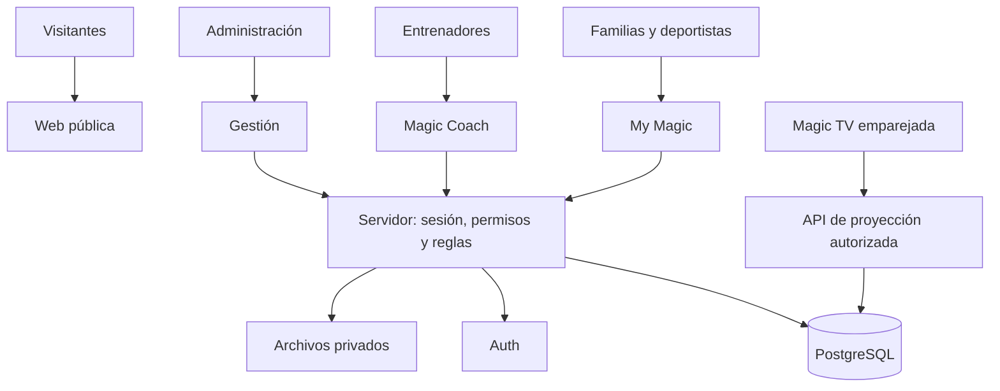

# Magic: arquitectura y ruta a producción

Fecha: 5 de octubre de 2026. Estado: diseño técnico propuesto; no implementado ni desplegado.

La revisión consolidada del alcance y condiciones de lanzamiento está en [REVISION-FINAL-MAGIC.md](REVISION-FINAL-MAGIC.md). Incluye fichas digitales y fotos familiares y oficiales en la primera entrega.

### Alcance confirmado por el usuario

- 7 equipos, de aproximadamente 10 a 20 deportistas cada uno: entre 70 y 140 deportistas inicialmente.
- Tres tipos de usuario desde la primera entrega: `family` (padres/deportistas), `coach` (entrenadores) y `admin` (administrador total).
- Dentro de `family`, el vínculo aprobado determina si la cuenta consulta a sus deportistas asociadas o únicamente su propio perfil. No constituye un cuarto rol ni concede acceso al resto del equipo.
- Una página de acceso identifica la sesión y dirige al panel autorizado. Elegir un tipo de acceso en la interfaz no concede ese rol. Administración asigna roles y vínculos; no hay autorregistro con privilegios.
- Magic TV es un dispositivo emparejado con permisos de proyección, no un cuarto tipo de usuario humano.
- Confirmados 6 entrenadores. El administrador podrá agregar o eliminar entrenadores y gestionar sus asignaciones por equipo. Cantidad de acudientes y pantallas pendiente; no se confirmó todavía un proveedor contratado de autenticación o base de datos.

| Equipo confirmado | Entrenadores indicados  | Edades confirmadas |
| ----------------- | ----------------------- | ------------------ |
| Magic Beautiful   | Angela y Laura          | 4–7 años           |
| Magic Power       | Angie                   | Pendiente          |
| Magic Energy      | AH (nombre provisional) | Pendiente          |
| Magic Infinity    | Isabella                | Pendiente          |
| Magic Love        | Milton                  | Pendiente          |
| Magic Joy         | Milton                  | Pendiente          |
| Magic Stronger    | Milton                  | Pendiente          |

Angela y Angie se conservan como personas distintas según lo indicado. AH es una etiqueta provisional, no una identidad verificada para emitir una invitación. Milton es dueño y coach; la arquitectura admite que una cuenta tenga rol administrativo y de entrenador, sin duplicarla. La titularidad de la primera cuenta de administrador total queda por confirmar.

### Gestión de entrenadores confirmada

Desde `/admin/entrenadores`, el administrador puede crear e invitar entrenadores, editar sus datos, retirarlos y asignarlos o desasignarlos de uno o varios equipos. Un equipo admite varios coaches y un coach admite varios equipos; las asignaciones iniciales son configurables, no valores fijos en el código.

Eliminar un entrenador de la operación desactiva su rol de coach y finaliza sus asignaciones activas, conservando autoría de evaluaciones, comentarios y registros históricos. La autorización de las siguientes peticiones debe comprobar ese estado actualizado. Si la cuenta también tiene otro rol, retirarla como coach no elimina automáticamente sus demás permisos. La eliminación definitiva de datos personales sigue el procedimiento de retención, separado de esta acción operativa.

Cada cambio de asignación registra administrador responsable, equipo, entrenador y fecha de inicio o fin. Desasignar un coach retira su acceso a ese equipo; asignar otro le permite consultar el historial deportivo necesario sin cambiar quién realizó las evaluaciones anteriores. Los cambios de rol y asignación son transaccionales y auditados. Evitar retirar al último administrador activo mediante operaciones de gestión de usuarios.

Pruebas de aceptación de este módulo: alta e invitación; dos coaches en Beautiful; Milton en tres equipos; cambio de coach con conservación de autoría; retirada de acceso tras desasignación o baja; conservación de otros roles de una misma cuenta; denegación de gestión de entrenadores a familias y coaches.

Este volumen es compatible con la arquitectura propuesta sin justificar microservicios. El número de sesiones simultáneas, tamaño de medios y frecuencia de consultas determinarán las pruebas de carga y el plan contratado; 140 deportistas no equivale a 140 cuentas o conexiones simultáneas.

## 1. Diagnóstico y objetivo

El repositorio contiene una landing estática en `index.html`, con CSS y JavaScript embebidos, recursos gráficos, SEO y configuración de Vercel. El formulario abre WhatsApp. No hay dependencias de aplicación, autenticación, API, migraciones, base de datos o pruebas. Existe asociación local al proyecto Vercel `magic`; el README indica despliegue desde `main`, pero esa integración remota debe verificarse antes de publicar. El árbol de trabajo estaba limpio al iniciar este análisis.

Objetivo: mantener la web comercial y añadir seguimiento deportivo, herramientas de entrenadores, administración y una pantalla automática para la academia. El enlace compartido «NEW MAGIC» aporta el concepto y la petición explícita de un ciclo por equipos e integrantes; niveles, porcentajes, rúbricas y tiempos son propuestas, no reglas deportivas aprobadas.

La landing usa Mini/Junior/Youth/Elite; el usuario confirmó los siete equipos en la tabla anterior. La migración de contenido debe adoptar ese catálogo. Solo Beautiful tiene edades confirmadas; no deducir las de los demás equipos.

## 2. Decisión arquitectónica

Recomiendo un monolito modular: una aplicación Next.js con TypeScript en Vercel y Supabase para PostgreSQL, autenticación y archivos privados. Un repositorio, una aplicación y módulos separados por dominio. Evita operar varios servicios propios para los 7 equipos y 70–140 deportistas previstos.

Next.js permite servir la presentación y las rutas privadas en el mismo dominio. La selección de versión estable y compatible, sus parches y el archivo de dependencias bloqueadas se resolverán al implementar. No se instalarán versiones preliminares.

Una fuente de datos no significa una respuesta idéntica para todos. Las vistas de familias, entrenadores y TV aplican permisos y proyecciones diferentes sobre registros comunes. La API general de progreso nunca será pública.

## 3. Módulos y navegación

| Ruta propuesta               | Función                                                         |
| ---------------------------- | --------------------------------------------------------------- |
| `/`                          | Landing, programas, contacto y acceso a My Magic                |
| `/acceso`                    | Invitación, inicio de sesión y recuperación                     |
| `/mi-magic`                  | Selección de deportista vinculada y resumen                     |
| `/mi-magic/deportistas/[id]` | Habilidades, historial, metas, badges y comentarios compartidos |
| `/coach`                     | Equipos asignados y tareas pendientes                           |
| `/coach/equipos/[id]`        | Lista, asistencia y evaluaciones rápidas                        |
| `/admin`                     | Personas, vínculos, equipos, metodología y auditoría            |
| `/admin/entrenadores`        | Altas, bajas y asignaciones de coaches                          |
| `/admin/deportistas`         | Fichas digitales, equipos y vínculos familiares                 |
| `/mi-magic/momentos`         | Galería autorizada, aportes y estado de revisión                |
| `/coach/contenido`           | Revisión de fotos de equipos asignados                          |
| `/admin/contenido`           | Fotos oficiales y moderación general                            |
| `/admin/pantallas`           | Emparejamiento, selección de equipos y configuración de TV      |
| `/magic-tv`                  | Reproductor automático autorizado por dispositivo               |

Estructura propuesta: `src/app` para rutas, `src/modules/{athletes,teams,evaluations,progress,attendance,reports,competitions,tv}`, `src/lib/{auth,db,validation}`, `supabase/migrations`, `supabase/tests` y `tests/e2e`. Componentes comunes para identidad visual, formularios y estados de carga/error.

## 4. Identidades y permisos

Inicialmente las familias acceden mediante una cuenta de adulto invitada por administración. Una deportista puede existir sin usuario propio; los accesos individuales se habilitan solo cuando la academia defina su política. Verificar correo no demuestra parentesco: la vinculación debe aprobarse administrativamente.

| Actor                 | Lectura                                                                                      | Escritura                                                                           |
| --------------------- | -------------------------------------------------------------------------------------------- | ----------------------------------------------------------------------------------- |
| Visitante             | Contenido comercial                                                                          | Formulario de interés si se añade almacenamiento                                    |
| Acudiente             | Deportistas vinculadas, resultados publicados y galería autorizada; reportes al habilitarlos | Avatar, fotos deportivas permitidas, aportes pendientes y autorizaciones permitidas |
| Deportista con acceso | Su propio perfil publicado y contenido de equipo autorizado                                  | Avatar y foto propia según política de academia; nunca modifica evaluaciones        |
| Entrenador            | Equipos asignados y expedientes deportivos necesarios                                        | Borradores, evaluación, validación y asistencia de sus equipos                      |
| Administrador         | Gestión de la academia                                                                       | Altas, asignaciones, rúbricas, publicación y correcciones auditadas                 |
| Dispositivo TV        | Proyección autorizada de equipos seleccionados                                               | Solo estado técnico de su sesión                                                    |

Autorización en servidor y políticas RLS en PostgreSQL; comprobar tanto la operación como el registro solicitado. Ocultar botones no protege datos. Roles y asignaciones se administran desde tablas protegidas, nunca desde metadatos editables por el usuario. Revocar una asignación debe retirar acceso sin esperar a que expire una sesión larga. MFA para administradores y preferiblemente entrenadores.

Usar sesión del usuario para consultas ordinarias. Las claves con privilegios elevados quedan exclusivamente en servidor y solo en operaciones justificadas; no pueden convertirse en una vía que ignore las políticas. Revisar también permisos SQL, vistas, funciones y almacenamiento. Denegar acceso anónimo a datos deportivos.

## 5. Modelo de datos

| Entidades                                                                   | Relación o responsabilidad                                                                    |
| --------------------------------------------------------------------------- | --------------------------------------------------------------------------------------------- |
| `profiles`, `user_roles`                                                    | Identidad de usuario y funciones autorizadas                                                  |
| `athletes`                                                                  | Perfil deportivo; independiente del usuario de acceso                                         |
| `guardian_athletes`                                                         | Muchos acudientes por deportista y varias deportistas por acudiente; aprobación y revocación  |
| `teams`, `seasons`                                                          | Catálogo y temporadas                                                                         |
| `team_memberships`, `coach_assignments`                                     | Participaciones y asignaciones con fechas; permite varios equipos e historial                 |
| `skill_areas`, `skills`                                                     | Áreas y habilidades con prerrequisitos                                                        |
| `curriculum_versions`, `curriculum_skills`, `criteria`                      | Rúbricas, aplicabilidad por etapa y versiones inmutables publicadas                           |
| `evaluation_sessions`, `evaluations`, `criterion_results`                   | Quién evaluó, cuándo, versión, estado y resultado por criterio                                |
| `skill_validations`                                                         | Dominio validado por entrenador y posibles revocaciones justificadas                          |
| `goals`, `coach_comments`                                                   | Próximos retos; comentarios internos separados de los compartidos                             |
| `badge_definitions`, `badge_awards`                                         | Reglas versionadas y concesiones trazables                                                    |
| `training_sessions`, `attendance`                                           | Sesiones programadas y asistencia única por deportista/sesión                                 |
| `competitions`, `team_goals`                                                | Metas colectivas y preparación técnica de rutina                                              |
| `report_snapshots`                                                          | Reporte mensual inmutable con versión de cálculo y fecha de corte                             |
| `media_assets`, `consents`                                                  | Archivos, alcance de autorización y revocación                                                |
| `posts`, `post_assets`, `post_audiences`, `media_subjects`, `media_reviews` | Álbumes, imágenes, destinatarios, personas representadas y decisiones por imagen/equipo/canal |
| `tv_devices`, `tv_playlists`                                                | Dispositivos revocables y configuración de rotación                                           |
| `audit_events`, `outbox_jobs`                                               | Registro de cambios y trabajos reintentables                                                  |

UUID para claves, relaciones foráneas y restricciones únicas para asistencia, resultados por criterio y concesiones equivalentes. Índices en vínculos de acceso, equipo/temporada, deportista/fecha y trabajos pendientes. Las evaluaciones publicadas se corrigen con revisiones; no se sobrescribe el historial. Los cambios de equipo no trasladan automáticamente habilidades a rúbricas incompatibles.

## 6. Reglas del progreso

Estados de habilidad: sin evaluar, en proceso, validada y requiere revisión. Falta de evaluación no equivale a fracaso ni a cero técnico.

Propuesta inicial de cálculo, pendiente de aprobación deportiva:

- Cobertura: criterios evaluados / criterios aplicables.
- Progreso observado: suma de pesos de criterios logrados / suma de pesos de criterios evaluados aplicables. Mostrar siempre cobertura y fecha junto al porcentaje.
- Sin criterios evaluados: «Sin evaluación», nunca 0 %.
- Dominio de una habilidad: todos los criterios obligatorios y prerrequisitos cumplidos, más validación explícita del entrenador. Un promedio alto no puede compensar un criterio de seguridad pendiente.
- Nivel: requisitos de la versión del currículo, no edad deducida ni acumulación arbitraria de puntos. Los cinco niveles del chat son una opción por definir.
- Preparación para competencia: rúbrica colectiva de la rutina; no promedio indiscriminado de perfiles individuales.

Ejemplo de comprobación: 3 criterios logrados de 4 evaluados con pesos iguales y 5 aplicables significa 75 % observado y 80 % de cobertura. No acredita dominio si falta un criterio obligatorio.

Los cálculos se ejecutan en una capa de dominio del servidor, reutilizada por panel, reportes y TV. Publicar evaluación, validar logros y encolar trabajos será transaccional e idempotente. Repetir una petición no concede dos badges. Registrar actor, fecha, motivo de corrección y versión; manejar edición simultánea con control de versión y aviso de conflicto.

## 7. Magic TV

Rotación configurable: bienvenida → resumen de equipo → preparación colectiva si existe → integrantes autorizadas una a una → siguiente equipo → inicio. Valores iniciales propuestos: 10 segundos por deportista y 18 por equipo. El orden debe ser estable y permitir completar el ciclo aunque lleguen actualizaciones.

El administrador genera desde su perfil un enlace de activación por pantalla, con los equipos y contenidos ya seleccionados. Abrirlo en el televisor inicia el ciclo sin aprobación adicional ni intervención de entrenadores. El enlace contiene un secreto aleatorio de un solo uso y vencimiento configurable; se intercambia mediante POST por una sesión persistente de dispositivo restringida. Guardar únicamente el hash del secreto en servidor y consumirlo de forma atómica. La página de activación no carga analítica ni recursos de terceros, usa política de referente `no-referrer`, recibe el secreto en el fragmento de URL y lo elimina del historial tras el intercambio.

La sesión se conserva en cookie Secure y HttpOnly, con rotación automática y renovación mientras el dispositivo continúe autorizado. Las comprobaciones de autorización son automáticas: no requieren presencia humana. Tras reiniciar el navegador, abrir `/magic-tv` reutiliza esa sesión. Si se borran las cookies, cambia el dispositivo o se revoca el acceso, el administrador genera otro enlace. No prometer arranque automático al encender cualquier televisor: depende del navegador o modo kiosco instalado.

Desde administración se puede abrir Magic TV, copiar el enlace de activación, ajustar el contenido, ver última conexión y revocar cada pantalla. Nunca compartir la sesión del administrador ni crear una URL pública permanente con acceso a perfiles. El enlace de activación concede únicamente proyección, no gestión ni acceso a observaciones privadas. El arranque y reanudación tras reinicio forman parte de las pruebas en el televisor real.

`GET /api/tv/feed` valida dispositivo, equipos permitidos y autorizaciones activas. Devuelve solo nombre de exhibición, foto permitida, equipo, logros publicados y próximo reto positivo. Excluye apellidos completos por defecto, contacto, fecha de nacimiento, observaciones internas, asistencia y comparaciones individuales. El permiso para TV es distinto del permiso para redes.

Primera versión: consulta cada 30 segundos y reemplazo del conjunto al cambiar de tarjeta. Una interrupción de red breve permite continuar el contenido en memoria; después de 60 segundos sin autorización renovada se muestra una pantalla de marca sin datos personales. No persistir el feed en localStorage ni en un service worker. Al recibir revocación, borrar el contenido inmediatamente. El límite de 60 segundos define también la exposición máxima prevista ante pérdida de conectividad.

La duración del feed y las URLs de medios deben respetar esa caducidad. Las fotos originales permanecen privadas. Reproducción sin audio automático, letras grandes y animación reducida cuando corresponda. La pantalla completa puede requerir un clic inicial del operador. Verificar en el televisor real, no asumir compatibilidad por la marca del dispositivo.

Sin equipos o integrantes autorizadas: mostrar marca, nunca una lista vacía rota. Al añadir integrantes se incluyen en la siguiente actualización. Los logros recientes pueden destacarse sin interrumpir indefinidamente la rotación normal.

## 8. API y procesos

Contratos propuestos:

- `GET /api/me/athletes`: perfiles permitidos para la sesión.
- `GET /api/athletes/[id]/progress`: estado publicado, cobertura, versión y fecha.
- `POST /api/evaluations`: borrador validado y limitado a equipos asignados.
- `POST /api/evaluations/[id]/publish`: publicación transaccional con clave de idempotencia.
- `POST /api/attendance`: registro por sesión con control de duplicados.
- `POST /api/admin/tv/devices`: genera dispositivo y enlace de activación; solo administrador.
- `POST /api/tv/activate`: consume el enlace de un solo uso y establece la sesión restringida, sin segunda aprobación.
- `POST /api/tv/session/refresh` y `GET /api/tv/feed`: renovación automática y proyección autorizada del dispositivo.
- `POST /api/reports`: solicitud de generación; archivo privado cuando finalice.

Validación de entrada, paginación, límites de tamaño, controles de origen/CSRF en escrituras con cookies, límites de intentos y errores sin datos privados. Respuestas privadas con `Cache-Control: no-store`; no compartir caché de contenido autenticado. Fechas almacenadas en UTC y presentadas en America/Bogota.

PDF, avisos y piezas gráficas se procesan mediante trabajos persistentes con estado, reintentos limitados e idempotencia. Un error de envío no deshace una evaluación. En la primera entrega basta reporte web imprimible; PDF automatizado, WhatsApp y piezas sociales entran después. No asumir envío gratuito o integración existente con WhatsApp.

## 9. Datos y operación

Fotos y reportes en almacenamiento privado con acceso temporal autorizado. Validar tipo y tamaño de archivo; eliminar metadatos innecesarios. Separar datos deportivos de cualquier información médica futura; no recogerla para este alcance.

Registrar quién autorizó proyección, para qué canales, cuándo y cómo se revoca. Definir con la academia la retención, cierre de cuentas y eliminación de datos antes de ingresar menores reales. Esta especificación es técnica, no certifica cumplimiento legal.

Logs de fallos sin nombres, contactos, contenido de evaluaciones o tokens; auditoría protegida contra modificación desde usuarios comunes. Alertas ante errores de acceso, fallos de publicación y trabajos agotados. Copias de base de datos y de archivos por separado: los backups de PostgreSQL de Supabase no incluyen los objetos de Storage.

Objetivos operativos iniciales propuestos: recuperación en 4 horas y pérdida máxima de datos de 24 horas. Confirmarlos frente al plan contratado; ensayar restauración en un entorno aislado. Si la operación exige menor pérdida, contratar/configurar recuperación apropiada antes del lanzamiento.

## 10. Migración y publicación

1. Implementar en una rama de trabajo; no publicar cambios incompletos sobre `main`.
2. Convertir la landing en la ruta pública conservando identidad, enlaces, metadatos y recursos. Comparar escritorio y móvil. Corregir contenidos provisionales con material real aprobado.
3. Crear entornos separados: desarrollo con datos sintéticos, staging con base propia y producción con base propia. Vercel Preview nunca apuntará a datos de menores en producción.
4. Aplicar migraciones reproducibles, políticas y pruebas; crear el primer administrador por procedimiento controlado.
5. Configurar dominio, cookies, URLs permitidas de autenticación, correo transaccional y variables por entorno. Añadir `.env*` a exclusiones antes de crear secretos, conservando solo `.env.example` sin valores reales.
6. Cargar catálogo deportivo aprobado y probar el flujo completo con datos ficticios; después piloto real acotado.
7. Habilitar al resto de equipos después de verificar permisos, métricas y uso en el televisor real.

Cambiar el proyecto de Vercel de estático a Next.js implica revisar configuración de compilación, rutas y cabeceras. La caché inmutable actual de `/assets/*` requiere nombres versionados al reemplazar archivos. No reutilizar la misma URL para una imagen cambiada durante un año de caché.

Rollback: conservar despliegue anterior de aplicación, usar migraciones compatibles de expansión antes de eliminar columnas y desactivar módulos mediante configuración. Revertir el código no revierte la base de datos; no hacer migraciones destructivas en el primer lanzamiento.

## 11. Plan de ejecución y criterios de salida

| Entrega                | Contenido                                                                   | Criterio de salida                                                                   |
| ---------------------- | --------------------------------------------------------------------------- | ------------------------------------------------------------------------------------ |
| A. Fundamentos         | App, entornos, sesión, roles, esquema, RLS, invitaciones                    | Un acudiente no accede a otra familia; un coach no accede a otro equipo              |
| B. Operación deportiva | Equipos, vínculos, rúbricas, evaluación, publicación, metas y badges        | Publicación trazable y repetible sin duplicados; reglas aprobadas                    |
| C. Familias y TV       | Perfil privado, evolución, emparejamiento y ciclo completo                  | Mismos resultados de origen; TV no contiene campos privados y respeta revocación     |
| D. Producción inicial  | Piloto, alertas, respaldos, restauración y documentación de operación       | Pruebas críticas aprobadas, dispositivos reales verificados y responsables definidos |
| E. Ampliación          | Asistencia, reportes mensuales, competencias, certificados y notificaciones | Cada módulo conserva permisos e historial; aprobación funcional por la academia      |

Todo el ecosistema está contemplado, pero los módulos pueden activarse progresivamente para evitar que un componente incompleto bloquee el uso validado de los demás.

Pruebas imprescindibles: RLS permitiendo y denegando operaciones por actor; acceso directo por UUID ajeno; revocación de vínculos; porcentajes con no evaluados/no aplicables; prerrequisitos; corrección histórica; doble envío y concurrencia; rotación TV con cero/uno/varios equipos; desconexión y vencimiento; filtrado del JSON y archivos de TV; navegación por teclado, contraste y móvil; restauración de base y medios. Pruebas de carga dimensionadas cuando se conozca el número de usuarios y pantallas.

## 12. Pendientes concretos para ejecutar

- Confirmados 7 equipos, aproximadamente 70–140 deportistas y 6 entrenadores. Falta reemplazar AH por su nombre real. Faltan cantidad de cuentas familiares y pantallas, navegador y resolución de cada TV.
- Confirmar catálogo real, edades, temporadas, criterios de dominio, quién valida y quién aprueba cambios de método.
- Identificar responsable administrador y modelo de vinculación de acudientes.
- Crear o vincular proyecto Supabase y confirmar acceso operativo a Vercel; no se verificaron credenciales de despliegue en este análisis.
- Definir dominio, remitente de correo y presupuesto operativo. Estimar costes por base, almacenamiento, transferencia de fotos, correo y despliegue después de conocer volumen; no prometer producción gratuita.
- Aprobar contenido visible en TV, autorizaciones y retención antes de cargar información real.

El trabajo de arquitectura queda listo para implementar. La existencia del documento no equivale a una aplicación funcional, pruebas de aceptación aprobadas ni despliegue en producción.

## 13. Revisión final previa a implementación

Dictamen: alcance suficiente para comenzar la construcción; todavía no apto para publicación operativa. Se revisó el documento contra los requisitos confirmados y la estructura del repositorio. No se ejecutaron pruebas de aplicación porque aún no existe la aplicación privada. Las decisiones siguientes completan el diseño técnico propuesto; no convierten reglas deportivas pendientes en acuerdos aprobados.

### Vacíos detectados y resolución de diseño

1. **Una deportista en varios equipos.** Cada evaluación, objetivo y comentario tiene equipo, temporada y versión del currículo. Un coach autorizado en un equipo no adquiere acceso a notas internas de otros equipos por compartir deportista. Distinguir perfil deportivo común, resultados publicados y observaciones internas del equipo. Aplicar esta separación a las consultas, archivos y políticas, no solo a las pantallas.
2. **Cuenta con varios roles.** Milton u otra persona puede cambiar entre las vistas que tenga autorizadas. Cambiar la vista no cambia permisos. Operaciones administrativas exigen rol admin vigente; operaciones de coach exigen asignación vigente o una intervención administrativa explícita y auditada. La desactivación de coach conserva el rol admin cuando corresponda.
3. **Publicación y revisión.** El coach asignado puede publicar evaluaciones de su equipo; no se añade una aprobación administrativa por cada evaluación. Familias y TV no ven borradores. Corregir un resultado publicado crea una revisión con motivo; recalcula resultados derivados y retira badges que ya no correspondan, manteniendo el historial de concesión y revocación. Un reporte cerrado conserva su corte y señala si existe una corrección posterior.
4. **Comparaciones de progreso.** El porcentaje observado no es por sí solo una medida de mejora mensual: puede bajar al evaluar criterios nuevos. Comparar períodos únicamente con la misma versión, conjunto de criterios y pesos, e indicar cobertura. Si cambió la base, mostrar logros y cambios de estado sin inventar una variación porcentual. Cada criterio cuenta una sola vez en el resultado vigente, usando su última evaluación publicada válida hasta la fecha de corte; las revisiones sustituyen el resultado, no se suman. Todas las pantallas de un mismo corte usan el mismo cálculo.
5. **Ciclo TV prolongado.** A 10 segundos por deportista y 18 por equipo, 70 deportistas y 7 equipos requieren 826 segundos (13 min 46 s); 140 requieren 1.526 segundos (25 min 26 s), antes de bienvenida y competencia. Administración puede elegir todos los equipos o un subconjunto para esa pantalla y ajustar tiempos. Mostrar equipo actual y avance del ciclo; no prometer que todas aparezcan en pocos minutos.
6. **Actualización sin reiniciar el ciclo.** Mantener un cursor por identificador estable. Refrescar contenido sin regresar a la primera deportista cada 30 segundos. Incorporar nuevas tarjetas en la siguiente vuelta; retirar inmediatamente las que pierdan permiso. Si desaparece la tarjeta actual, continuar con la siguiente elegible. Los destacados no deben postergar indefinidamente a ninguna integrante. Definir paginación del feed para que un límite de consulta no omita deportistas silenciosamente.
7. **Sesión TV y permiso de proyección son distintos.** Renovar una cookie no extiende la vigencia de datos almacenados: solo una respuesta autorizada y reciente del feed renueva sus 60 segundos. Comprobar caducidad antes de pintar y al volver de suspensión, además del temporizador normal. Un error de red o respuesta denegada nunca reutiliza indefinidamente fotos. Las imágenes derivadas para TV se sirven por una ruta que verifica dispositivo y autorización, sin caché compartida ni optimizador público que conserve imágenes privadas.
8. **Enlace de activación.** «Abrir vista previa» desde admin no consume el enlace destinado al televisor. Permitir emitir uno nuevo e invalidar el anterior. El acceso persistente queda ligado al navegador activado; abrir el enlace ya consumido en otro dispositivo muestra instrucciones claras. No introducir confirmaciones de entrenadores. Probar recarga, reinicio y recuperación automática tras volver la red.
9. **Alta, traslado y baja de deportistas.** Administración crea perfiles, vincula acudientes y asigna equipos con fechas. Evitar duplicados mediante revisión, sin exigir documentos de identidad para este alcance. Una baja finaliza membresías activas, retira a la deportista de TV y bloquea nuevas evaluaciones ordinarias; conserva historia según retención acordada. La continuidad de consulta familiar después de baja debe definirse antes del piloto, sin dar por supuesto acceso indefinido.
10. **Recuperación de acceso.** Incluir invitaciones con vencimiento, reenvío, recuperación de contraseña y revocación de sesiones. No permitir que el mismo correo cree identidades duplicadas. Definir recuperación del administrador y MFA antes de operar; no bloquear al último admin ni compartir contraseñas entre coaches.
11. **Asistencia y calendario.** Al habilitar asistencia, calcularla sobre sesiones programadas aplicables durante la membresía activa; excluir cancelaciones. Conservar estados presente, ausente, justificada y sin registrar. La academia debe definir cómo cuentan las justificadas; no convertir sesiones sin registro en ausencias automáticamente.
12. **Alcance de la primera publicación.** Núcleo completo: usuarios, gestión de entrenadores y deportistas, equipos, vínculos, currículo configurable, evaluaciones, progreso, metas, badges, My Magic y Magic TV. Asistencia, reportes automatizados, competencias, certificados y notificaciones siguen en el plan posterior. La arquitectura admite todos; la primera publicación no se presentará como si ya los incluyera. La landing debe anunciar solo capacidades activas.

### Condiciones verificables para publicar

| Condición                     | Estado actual                           | Evidencia necesaria                                                               |
| ----------------------------- | --------------------------------------- | --------------------------------------------------------------------------------- |
| Equipos, escala y roles       | Confirmados                             | 7 equipos, 6 coaches, 70–140 deportistas; tabla inicial                           |
| Diseño técnico                | Revisado; pendiente de implementación   | Este documento y decisiones de esta sección                                       |
| Metodología deportiva         | Pendiente de academia                   | Catálogo y criterios aprobados; nombres de responsables de validación             |
| Aplicación y esquema          | No implementados                        | Compilación, migraciones y recorrido funcional en staging                         |
| Aislamiento de datos          | Diseñado, no probado                    | Pruebas de acceso permitido/denegado, incluyendo multi-equipo y multirol          |
| Producción y correo           | No configurados/verificados             | Servicios vinculados, variables por entorno, invitación y recuperación entregadas |
| Datos reales y autorizaciones | Pendientes                              | Perfiles y vínculos revisados; permisos de exhibición registrados                 |
| TV real                       | Sin dispositivo identificado ni probado | Ciclo completo, reinicio, revocación y desconexión en hardware de academia        |
| Operación                     | Pendiente                               | Responsable, alertas, restauración ensayada y procedimiento de reversión          |

No bloquean comenzar con datos ficticios: nombre definitivo de AH, edades faltantes, número final de acudientes y fotografías reales. Sí bloquean activar el módulo correspondiente con datos reales: identidad de quien recibe invitaciones, rúbricas deportivas aprobadas, autorizaciones y verificación de permisos. No solicitar contraseñas ni claves en el chat; configurar secretos por los mecanismos del proveedor.

Prueba integral de salida: admin crea equipo y asigna coach → vincula deportista y acudiente → coach evalúa y publica → familia consulta su resultado → TV muestra solo lo autorizado → admin desasigna coach y revoca proyección → ambos accesos se retiran según sus reglas, conservando la autoría histórica. Ejecutar además la misma secuencia con una deportista en dos equipos y una cuenta con dos roles.

## 14. Fotos de perfil y contenido de la semana

Requisito añadido por el usuario: cada usuario puede tener foto de perfil; permitir agregar fotos de la semana y contenidos similares. Se incorpora al alcance de la primera entrega una galería privada sencilla y configurable. Las publicaciones públicas y automatizaciones de redes no forman parte de esta incorporación.

### Fotos de perfil

- Familias, deportistas con cuenta, entrenadores y administradores pueden subir, reemplazar o quitar su propia foto. Mostrar iniciales cuando no exista foto.
- Separar avatar de cuenta (`profiles.avatar_asset_id`) y foto deportiva (`athletes.photo_asset_id`): un acudiente con varias deportistas conserva su avatar y cada deportista su propia imagen.
- Un acudiente con vínculo vigente y permiso de edición puede gestionar la foto de sus deportistas; administración puede gestionarlas también. La cuenta propia de deportista puede cambiar su imagen conforme a la política de acceso definida por la academia.
- La foto de una cuenta no se publica automáticamente. La foto deportiva solo pasa a TV si existe permiso vigente para ese uso. Cambiarla no amplía el alcance de la autorización.
- Recorte cuadrado, previsualización antes de guardar y eliminación de la foto sin eliminar la cuenta. Al reemplazarla, retirar su asociación anterior y procesar la limpieza del archivo según retención; no reutilizar URLs de archivos reemplazados.

### Galería y publicaciones

Sección «Momentos Magic» con álbumes por equipo y semana. Tipos iniciales configurables: fotos de la semana, entrenamientos, logros, competencias y eventos. Cada publicación admite título, descripción breve, fecha, varias fotos y equipo destinatario. No incluye comentarios, reacciones, chat o videos en la primera versión.

El administrador puede crear, editar, publicar, archivar o retirar publicaciones de cualquier equipo. Un entrenador puede hacerlo para sus equipos asignados. Familias y deportistas pueden consultar publicaciones autorizadas de sus equipos. El usuario confirmó que las familias podrán subir fotos y que, después de aceptarlas, se incorporarán automáticamente a Magic TV según el equipo. Sus aportes se reciben pendientes de revisión por coach asignado o admin; subir una foto no la publica inmediatamente para otras familias ni en TV.

Flujo confirmado: familia selecciona una deportista vinculada y uno de sus equipos activos → sube las fotos → envía para revisión → coach de ese equipo o administrador acepta las fotos para Magic TV → aparecen automáticamente en el bloque de ese equipo en las pantallas que lo tengan seleccionado. Si existe más de un equipo elegible, la familia elige el destino; el servidor verifica la membresía y no acepta equipos arbitrarios. No se requiere una segunda selección manual del administrador después de aceptar.

La bandeja de revisión permite aprobar o rechazar cada foto por separado y comunicar un motivo de rechazo. La acción se llama «Aceptar para Magic TV», para dejar claro dónde se mostrará; comprueba previamente las autorizaciones del medio y registra revisor, fecha y equipo. Los estados visibles para la familia son pendiente, aceptada para TV, rechazada y retirada/vencida. Reenviar una imagen rechazada o reemplazar una ya aceptada exige nueva revisión; la aceptación anterior no se transfiere a un archivo distinto.

La aceptación crea una única inclusión elegible por foto y equipo, de manera idempotente. Las fotos aparecen con la siguiente actualización del feed dentro de 30 segundos cuando la pantalla está conectada; su exhibición ocurre al llegar al bloque correspondiente, sin interrumpir la tarjeta actual. Aprobar para TV no publica la foto automáticamente en la web pública; la visibilidad en el álbum privado se controla por su propia audiencia. El autor puede retirar su aporte y un moderador puede retirar la aceptación, eliminando su elegibilidad en TV según los plazos de revocación definidos.

### Fotos oficiales de administración

Requisito confirmado: administración también puede agregar fotos oficiales al sistema. Desde la misma galería, el administrador carga las imágenes, añade título y descripción, selecciona uno o varios equipos destinatarios y decide si publicarlas en el portal privado, en Magic TV o en ambos. Puede guardar un borrador o publicar directamente; no requiere que un entrenador apruebe el contenido administrativo.

La publicación directa exige las mismas comprobaciones técnicas y autorizaciones de imagen que cualquier otro contenido. Para TV, la acción explícita «Publicar en Magic TV» registra al administrador como responsable y hace elegibles las imágenes automáticamente en los bloques de los equipos seleccionados. Mantener la exclusión de la web pública salvo una funcionalidad y autorización específicas futuras. Permitir editar, sustituir, archivar y retirar fotos oficiales; un archivo sustituido debe validarse y publicarse de nuevo, sin heredar silenciosamente autorizaciones del anterior.

Registrar origen `official` o `family`, autor de carga, responsable de publicación, equipos, audiencias y fechas. El servidor determina el origen oficial a partir de los permisos y la operación administrativa; una familia no puede marcar su aporte como oficial. Ambos orígenes comparten almacenamiento, controles de acceso y rotación por equipo, y la interfaz permite filtrarlos. No dar prioridad ilimitada al contenido oficial que impida mostrar aportes familiares aceptados o deportistas.

Pruebas adicionales: publicación oficial por admin sin segunda aprobación; rechazo de origen oficial enviado por una familia; asignación a uno o varios equipos; visibilidad independiente de portal y TV; retirada de fotos oficiales y conservación de auditoría.

Para varias deportistas de una familia, la galería muestra los equipos vinculados sin conceder acceso a álbumes ajenos. La audiencia se determina por membresía activa al consultar; una baja o traslado retira acceso al equipo anterior, salvo una política histórica explícita que se defina posteriormente. El permiso para subir no permite editar ni retirar contenido de otros autores.

Los borradores son visibles únicamente para su autor y moderadores autorizados. Un coach revisa solo contenido de sus equipos. Una publicación con varios equipos requiere administración o permiso del coach en todos los equipos de destino. Archivar preserva el registro sin mantenerlo visible a familias ni TV.

### Audiencias y Magic TV

Cada publicación tiene destinatarios explícitos: equipo(s) en portal privado y, opcionalmente, Magic TV. La web pública no es una audiencia activada por defecto. Una autorización para mostrar progreso individual no autoriza automáticamente un álbum ni la imagen de otras personas que aparecen en una foto grupal.

Antes de publicar, el responsable revisa el contenido y registra las personas identificables y los permisos aplicables. Ninguna foto grupal se considera autorizada solo porque quien la subió dio permiso. Mientras la revisión esté pendiente, la imagen no se muestra a la audiencia. Una revocación retira los recursos afectados del portal o de TV según el alcance revocado, incluidos sus derivados.

La sección «Fotos de la semana» queda habilitada en Magic TV para incorporar automáticamente fotos familiares aceptadas para los equipos seleccionados; si no hay fotos aceptadas, se omite el bloque. Administración puede pausar la sección o configurar vigencia y cantidad máxima de tarjetas por vuelta. Las fotos se insertan en el bloque de su equipo sin impedir que aparezcan todas las deportistas. Si hay más fotos que el límite por vuelta, rotarlas de forma equitativa entre vueltas; no seleccionar siempre las mismas primeras. El tiempo adicional se incluye en la duración estimada del ciclo. La bandeja informa si una foto aceptada está esperando su turno, si su equipo no está seleccionado en ninguna pantalla o si la sección está pausada.

### Implementación y almacenamiento

Añadir `posts`, `post_assets`, `post_audiences`, `media_subjects` y `media_reviews`. `posts` guarda autor, tipo, título, texto plano, estado (borrador, pendiente, publicado, archivado), fechas de publicación/vencimiento y versión para evitar sobreescrituras simultáneas. Los enlaces a `media_assets` conservan posición y texto alternativo. `media_reviews` registra versión del archivo y texto proyectado, equipo, canal, decisión, revisor y fecha. El estado del álbum no concede permiso a todas sus fotos: cada recurso debe tener aceptación vigente para su audiencia. Cambiar imagen, texto proyectado o destino invalida la revisión correspondiente. La autorización de cada medio y canal se vincula a `consents`; no depender únicamente de un booleano enviado por el cliente.

Subidas a almacenamiento privado en cuarentena mediante permiso temporal del servidor. Verificar acceso, tamaño, firma real del formato y dimensiones; decodificar y volver a codificar la imagen, corregir orientación y quitar EXIF antes de publicarla. Primera versión: JPEG, PNG y WebP, con límite inicial propuesto de 10 MB por archivo y 10 fotos por publicación. Rechazar SVG y formatos no compatibles con mensaje claro. Generar miniaturas y versiones optimizadas; los originales no se sirven directamente a TV.

Las políticas del archivo y de cada derivado comprueban la misma audiencia que la publicación. No basta ocultar la tarjeta si la URL continúa accesible. Usar identificadores de objetos generados en servidor, cuotas por usuario/equipo y limpieza de subidas abandonadas. El retiro de contenido revoca nuevos accesos; una copia ya descargada por una persona no puede recuperarse técnicamente.

### Verificación antes de activar

Probar avatar de los tres roles; cuenta familiar con dos deportistas y fotos distintas; sustitución y retirada de imágenes; rechazo de archivos inválidos; acceso directo a objetos de otro equipo; aportes familiares pendientes sin exposición; aceptación parcial de un álbum; inclusión automática solo en el equipo aprobado; doble aceptación sin duplicados; rotación equitativa cuando se supera el límite; sustitución que exige nueva revisión; publicación y baja de un coach; revocación de permisos de foto grupal; vencimiento de álbum; retiro inmediato de contenido del próximo feed TV y caducidad máxima ya definida. Añadir el volumen de imágenes y sus derivados al presupuesto de almacenamiento, transferencia y respaldo.

La primera entrega incluirá avatar, foto deportiva, álbumes privados, revisión de aportes y selección autorizada para TV. Esta sección amplía el alcance inicial descrito en la sección 13; aún no se ha implementado.

## Referencias técnicas consultadas

- Contexto funcional: https://chatgpt.com/share/6ac3e5fb-81dc-83e9-aa1f-45029f9f5a89
- RLS y permisos SQL: https://supabase.com/docs/guides/database/postgres/row-level-security
- Autenticación de servidor: https://supabase.com/docs/guides/auth/server-side/nextjs
- Alcance de backups: https://supabase.com/docs/guides/platform/backups
- Entornos de despliegue: https://vercel.com/docs/deployments/environments
